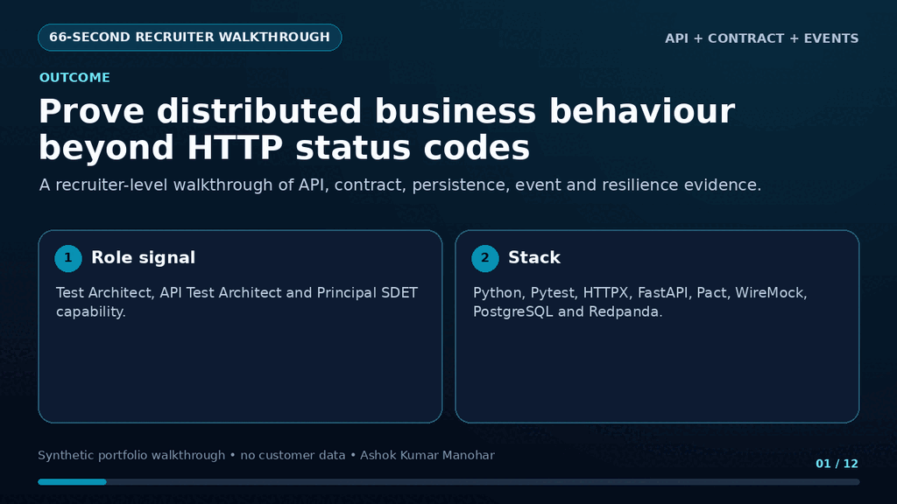
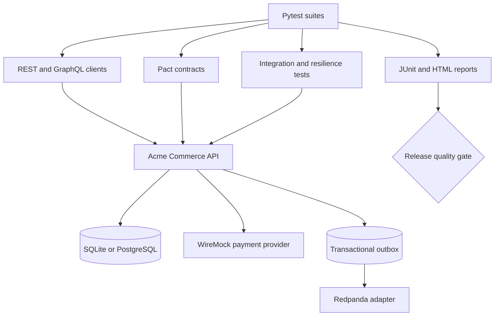

# API & Integration Testing Framework

[](https://github.com/ashokmanohar-ai/api-integration-testing-framework/actions/workflows/ci.yml)
[](https://www.python.org/)
[](https://docs.astral.sh/ruff/)
[](LICENSE)

An enterprise reference implementation for validating modern backend systems—not a collection of
HTTP calls. It demonstrates how a Quality Engineering team can test REST, GraphQL, authentication,
RBAC, consumer contracts, persistence, asynchronous events, dependency failures, retries,
idempotency and release gates as one maintainable system.

The repository is deliberately interview-friendly: a reviewer can start with the two showcase
workflows, see the client and model boundaries, then trace one correlation ID across API, database,
payment and event evidence.

## Recruiter quick tour

<p align="center">
  
</p>

> **60-second decision:** this repository proves distributed-system Test Architecture beyond endpoint checks, covering contracts, persistence, asynchronous events, authorization, failure injection and duplicate-side-effect prevention.

| Recruiter question | Verifiable answer |
| --- | --- |
| **Problem** | An HTTP 200 can still hide incorrect persistence, a lost event, duplicate payment or cross-tenant access. |
| **Architecture** | Typed REST/GraphQL clients drive a FastAPI provider; Pact verifies consumer contracts; SQLAlchemy checks state; WireMock controls dependency faults; a transactional outbox publishes typed events to Redpanda. |
| **Evidence** | Positive/negative/boundary and RBAC tests, real Pact provider verification, database/event correlation, timeout/retry/idempotency scenarios, Docker Compose, JUnit/HTML reporting and CI quality gates. |
| **Role signal** | Test Architect, API Test Architect, Integration Test Architect and Principal SDET. |

**Five-minute proof**

```bash
python -m venv .venv
source .venv/bin/activate
python -m pip install -e ".[dev,messaging,postgres]"
pytest -m smoke
```

Expected proof: portable, isolated API and validation evidence without an external service account. All datasets, applications and walkthrough claims are synthetic/reference evidence unless explicitly stated otherwise.

## The business problem

A green endpoint check does not prove that a distributed order workflow is correct. A request may
return `200` while storing the wrong record, duplicating a payment, losing an event or exposing
another customer's data. This project validates behaviour at each boundary and after failure.

## Portfolio signal

`Python + Pytest + HTTPX + FastAPI + REST + GraphQL + Pydantic + Pact + WireMock + SQLAlchemy +
PostgreSQL + Redpanda + Docker + GitHub Actions + quality gates`

Key capabilities:

- Thin, typed domain clients over HTTPX with direct response access
- Pydantic v2 request, response, error and event models
- Positive, negative, boundary, security and RBAC scenarios
- GraphQL queries, mutations, variables, nested data and `data`/`errors` semantics
- Pact V4 consumer tests plus provider verification against the real FastAPI provider
- WireMock payment approval, decline, 500, 503, timeout, malformed and recovery behaviours
- API-to-database consistency with SQLAlchemy repositories
- Transactional outbox events, typed schemas, correlation and bounded polling
- Business retry validation, idempotency and duplicate-side-effect prevention
- Isolated SQLite execution by default; PostgreSQL and Redpanda in Docker Compose
- Parallel-safe synthetic data, fixture cleanup, JUnit/HTML reports and a release gate
- GitHub Actions plus Jenkins and Azure DevOps examples

## Showcase workflows

### Successful order

1. Create an isolated customer and product.
2. Create an order and persist its items.
3. Emit `OrderCreated` with the API correlation ID.
4. Authorise payment through the dependency boundary.
5. Confirm the order and decrement inventory once.
6. Persist one payment and emit one `OrderConfirmed` event.
7. Validate API, database, events, sequence and correlation.

See `tests/integration/test_order_workflows.py::test_successful_order_showcase_workflow`.

### Payment provider unavailable

1. Create the same isolated preconditions.
2. Return `503` from the payment dependency.
3. Exercise the bounded three-attempt application retry policy.
4. Keep the order in `PAYMENT_FAILED` and inventory unchanged.
5. Persist one terminal payment record and emit `PaymentFailed`—never `OrderConfirmed`.

See `tests/integration/test_order_workflows.py::test_payment_503_showcase_failure_workflow`.

## Architecture



The demo deploys as one small process with logical identity, customer, product, order and payment
boundaries. This is an intentional portfolio trade-off: reproducible startup without pretending a
half-dozen toy containers constitute production microservices. The tests exercise the same failure
modes and seams that would exist between deployables.

## Test pyramid and scope

| Layer | Purpose | Examples |
|---|---|---|
| Contract | Detect consumer/provider drift quickly | Pact V4 client interaction and provider replay |
| API/component | Validate one boundary deeply | CRUD, schema, errors, pagination, RBAC, GraphQL |
| Integration | Validate state across components | API + payment + DB + outbox |
| End-to-end | Reserved for a small set of business journeys | The two highlighted order workflows |

Load generation and penetration testing are intentionally out of scope. Selected response-time and
functional security checks belong here; capacity testing and offensive testing belong in dedicated
toolchains.

## Repository structure

```text
config/                 validated DEV/QA/UAT configuration
framework/              clients, models, assertions, data, DB, messaging, utilities, quality gate
demo_system/            stable FastAPI Acme Commerce test target
tests/                  API, GraphQL, contracts, integration, DB, messaging and resilience suites
contracts/pacts/        committed consumer contract for provider verification
mocks/wiremock/         deterministic external payment behaviours
scripts/                environment startup, readiness, cleanup and validation
docs/                   strategy, architecture, CI and interview material
.github/workflows/      PR, contract and nightly pipelines
```

## Prerequisites

- Python 3.12 or newer
- Git
- Docker with Compose v2 for the full PostgreSQL/WireMock/Redpanda environment
- GNU Make is optional; equivalent Windows commands are documented below

## Install

```bash
python -m venv .venv
source .venv/bin/activate
python -m pip install --upgrade pip
python -m pip install -e ".[dev,messaging,postgres]"
```

PowerShell:

```powershell
py -3.12 -m venv .venv
.\.venv\Scripts\Activate.ps1
python -m pip install --upgrade pip
python -m pip install -e ".[dev,messaging,postgres]"
```

## Fast local run

The default test profile creates a unique SQLite database and deterministic payment adapter per
test. It needs no long-running service:

```bash
pytest
pytest -n auto
pytest -m smoke
pytest -m "api and not contract"
pytest -m graphql
pytest -m contract
pytest -m integration
pytest -m database
pytest -m messaging
pytest -m resilience
```

Markers are registered in `pytest.ini`; `--strict-markers` prevents silent typos.

## Full Docker environment

```bash
export POSTGRES_PASSWORD="$(openssl rand -hex 24)"
docker compose build
docker compose up -d
python scripts/wait_for_services.py
docker compose ps
RUN_DOCKER_TESTS=1 pytest -m docker
docker compose down -v
```

PowerShell uses the same commands, with the environment variable set as:

```powershell
$env:POSTGRES_PASSWORD = [guid]::NewGuid().ToString("N")
$env:RUN_DOCKER_TESTS = "1"
pytest -m docker
```

Services:

| Service | Local endpoint | Purpose |
|---|---|---|
| Acme API | `http://localhost:8000` | REST and GraphQL provider |
| PostgreSQL | `localhost:5432` | Production-style persistence target |
| WireMock | `http://localhost:8080` | Payment service virtualization and faults |
| Redpanda | `localhost:19092` | Kafka-compatible event integration target |
| Outbox worker | internal | Publishes committed outbox events to Redpanda |

All services have health checks. The readiness script uses bounded polling and fails with the name
of the dependency that did not become ready.

## Configuration and secrets

Select an environment with `TEST_ENV=dev|qa|uat`. DEV contains safe local URLs. QA and UAT require
`API_BASE_URL` and `GRAPHQL_URL` as environment variables so the framework fails before collection
instead of contacting an unintended system.

```bash
TEST_ENV=qa \
API_BASE_URL=https://qa.example.test \
GRAPHQL_URL=https://qa.example.test/graphql \
DATABASE_URL=sqlite:///./qa-validation.db \
pytest -m smoke
```

Secrets (`CLIENT_SECRET`, real bearer tokens and database credentials) come only from environment
variables or CI secret stores. Request logging recursively masks authorization, token, password,
secret and email fields. `.env.example` contains names, never credentials.

## REST and GraphQL design

`BaseApiClient` handles base URL, bearer headers, correlation, timing and sanitised diagnostics. It
does not convert HTTP into a proprietary abstraction: tests retain the native HTTPX response, and
domain clients add only stable business operations.

GraphQL uses normal HTTP requests and `.graphql` source files. A successful HTTP `200` is not enough;
`GraphQLClient.assert_success` rejects a payload with `errors`. Tests cover invalid fields, missing
variables, nested mutation output and authorization extensions.

## Authentication and authorization

The demo's deterministic tokens are documented non-secret test values. The client architecture
supports static test tokens or a password token provider and can be replaced with OAuth2 client
credentials/JWT validation for a real target.

RBAC coverage includes `ADMIN`, `CUSTOMER` and `SUPPORT`, plus ownership checks that detect IDOR-style
access to another customer's profile or order. Tokens are never printed.

## Contract testing

Pact consumer tests run the real domain clients against a Pact mock server and generate V4
contracts. Provider verification replays the committed Pact file against a real FastAPI server. An
optional field addition is shown as safe; renaming a required field is shown as breaking.

An enterprise implementation would publish to a Pact Broker, use consumer version selectors,
pending/WIP pacts and `can-i-deploy`. Local files keep this portfolio runnable without external
accounts. See [contract-testing.md](docs/contract-testing.md).

## Service virtualization and resilience

WireMock mappings model approval, decline, 500, 503, timeout, malformed JSON and a stateful
`503 → 503 → 200` recovery. Application retries are asserted as business behaviour; the generic API
client does not retry every request and hide defects.

Idempotency tests prove that replaying a payment key creates one payment and one confirmation event.
A key cannot be reused for a different order.

## Database and event validation

SQLAlchemy repositories keep query knowledge outside scenario bodies. Tests validate customer,
order, item, payment and inventory state with isolated data. SQLite is the fast default; the same
models run on PostgreSQL in Compose.

The transactional outbox gives events durable, queryable semantics before broker delivery. Event
tests validate UUIDs, types, payload, timestamps, ordering, unique IDs and correlation. In Docker,
the outbox worker publishes committed records to Redpanda and the Docker suite consumes the real
Kafka-compatible message; bounded polling replaces sleeps.

## Parallel execution and cleanup

Each test owns its application, database and generated UUID/email/SKU values. Workflow steps live
inside one test; no test relies on ordering. Fixture/context teardown closes transports and database
resources even on failure. This enables:

```bash
pytest -n auto
```

Suites that address one shared external WireMock scenario should reset WireMock or run serially;
the nightly workflow isolates that Docker check from the parallel in-process suite.

## Reporting and quality gates

```bash
pytest --junitxml=reports/junit.xml --html=reports/report.html --self-contained-html
quality-gate --junit reports/junit.xml --threshold 100
```

The gate fails on any test failure/error and enforces the configured executed-test pass rate.
Production teams can extend the same parser with suite-specific thresholds such as 100% smoke and
critical, 98% regression, and zero contract failures.

Allure is optional:

```bash
python -m pip install -e ".[reporting]"
pytest --alluredir=allure-results
allure serve allure-results
```

## CI/CD

- `ci.yml`: lint, formatting, type checks, Docker readiness, smoke/critical tests, full tests, gate
- `contract-tests.yml`: consumer contracts and provider verification
- `nightly-integration.yml`: full parallel regression plus Docker integration evidence
- `ci/Jenkinsfile` and `ci/azure-pipelines.yml`: equivalent enterprise starting points

Workflows use least-privilege read permissions and artifact uploads. They contain no secrets. See
[ci-cd.md](docs/ci-cd.md).

The latest truthful execution evidence is recorded in
[validation-report.md](docs/validation-report.md); unexecuted checks are never labelled PASS.

## Quality commands

```bash
ruff check .
ruff format --check .
mypy .
pytest --collect-only -q
pytest -n auto --junitxml=reports/junit.xml --html=reports/report.html --self-contained-html
quality-gate --junit reports/junit.xml
```

## Security

This is a functional QE framework, not a penetration-testing product. It includes missing/invalid/
expired authentication, role escalation, ownership, input boundary, oversized-field and unexpected
operation checks. Dependency scanning and responsible disclosure guidance are in [SECURITY.md](SECURITY.md).

## Design decisions

- **HTTPX over Requests:** sync/async capability, explicit timeout model, pooling and transport seams.
- **Pydantic plus JSON contracts:** executable type/nullability/enum boundaries and clear failures.
- **Pact plus integration tests:** contracts detect interface drift quickly; real integration proves
  wiring and state. Neither replaces the other.
- **WireMock only at the external boundary:** deterministic faults without claiming mocks prove all
  production integration.
- **Transactional outbox:** reliable event intent and testable eventual-consistency boundary.
- **One small demo deployable:** keeps focus on the QE framework and avoids theatre-level microservices.

## Limitations and roadmap

Genuine limitations:

- The local identity provider uses deterministic tokens; integrate Entra ID/Keycloak for a real IAM flow.
- Fast local event assertions use the outbox; real Redpanda delivery runs in the Docker profile.
- The demo is a modular service, not six independently deployed microservices.
- Response-time assertions are functional thresholds, not load/capacity evidence.

Reasonable extensions are OpenTelemetry trace export, schema-registry compatibility checks, Pact
Broker deployment gates, Testcontainers, Kubernetes ephemeral environments and DLQ replay tooling.

## Interview walkthrough

Start with the architecture and two showcase tests, then trace:

`factory → typed client → REST/GraphQL boundary → service → DB/payment/outbox → assertion → JUnit → gate`

The prepared two-minute/five-minute walkthrough and senior interview questions are in
[interview-walkthrough.md](docs/interview-walkthrough.md).

## Troubleshooting

Run `python scripts/validate_environment.py` before diagnosing target failures. For Docker startup,
run `docker compose ps`, `docker compose logs api`, and `python scripts/wait_for_services.py`. Full
diagnostic steps are in [troubleshooting.md](docs/troubleshooting.md).

## Contributing and licence

See [CONTRIBUTING.md](CONTRIBUTING.md) for branch, naming, marker, contract and evidence standards.
Security reports follow [SECURITY.md](SECURITY.md). Released under the [MIT License](LICENSE).
