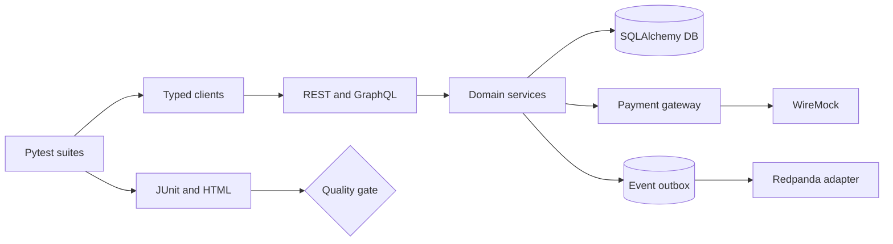

# Architecture

The repository separates test intent from transport, domain data and infrastructure evidence.

The base client owns cross-cutting HTTP concerns but returns the native response. Domain clients own
stable consumer operations. Pydantic models form executable boundaries. Tests reach the database
through repositories/assertions rather than embedding SQL.

The demo uses a modular FastAPI deployable to stay reproducible. Docker replaces SQLite and the
deterministic payment adapter with PostgreSQL and WireMock; Redpanda provides the Kafka-compatible
event target. In a microservice estate the same clients and contracts would point at independently
deployed endpoints, while test data and correlation remain unchanged.

Correlation enters through `X-Correlation-ID`, is stored on the order and propagated into every
outbox event. Failures therefore join HTTP, persistence and event evidence without logging secrets.

