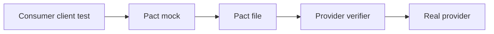

# Consumer-driven contract testing

The consumer defines the request it makes and the minimum response it needs. Pact runs the real
consumer client against a generated mock provider, writes the interaction, then the provider
verifier replays that interaction against the real provider.

Adding an optional response field is normally safe because consumers ignore it. Renaming/removing a
required property or changing its type is breaking; the examples make both outcomes executable.

Local Pact files remove infrastructure from the portfolio path. An enterprise rollout should use a
Pact Broker/PactFlow, immutable consumer versions, branches/environments, pending and WIP pacts,
provider states, verification publishing and `can-i-deploy` before promotion.

Contract tests detect interface drift; they do not prove database effects, broker delivery, network
configuration or a multi-service journey. Keep integration coverage.

